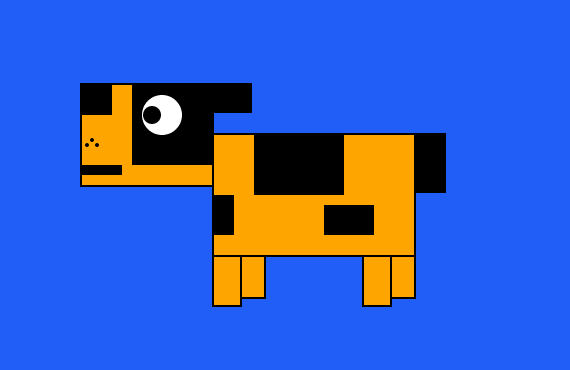
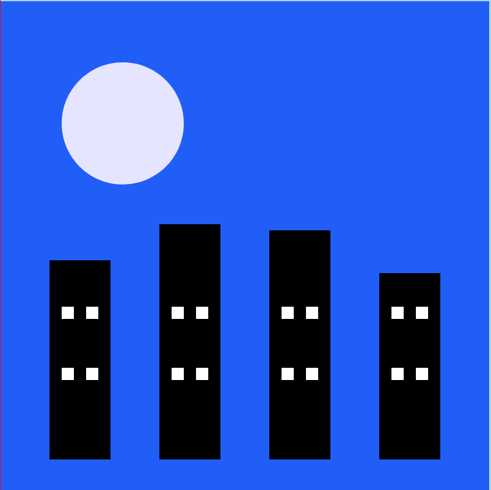

# Photo Album Viewer

## Object-Oriented Design Project

Welcome to the Photo Album Viewer, an object-oriented design project that enables users to create captivating photo albums by converting text input into visually stunning SVG/jSwing images. This project demonstrates the principles of object-oriented design and provides an opportunity to implement various design patterns.

## Project Overview

The Photo Album Viewer leverages object-oriented design to offer a flexible and extensible platform for creating and manipulating shapes within a photo album. It follows the MVC (Model-View-Controller) architecture, with two views available: Graphical and WebView. By adhering to the provided format guidelines, users can define shapes, move them, resize them, and customize their colors. The project currently supports rectangle and oval shapes, and it is designed for easy expansion to accommodate additional shape types in the future.

## Key Features

- **MVC Architecture**: The project follows a Model-View-Controller architecture, providing a modular and organized structure.
- **Object-Oriented Design**: The project utilizes an object-oriented approach to ensure code modularity, encapsulation, and reusability.
- **Extensibility**: Designed for easy expansion, allowing for the addition of new shape types and features in the future.

## How to Use

1. Clone the repository and open it in IntelliJ.
2. Export the artifact (Build -> Build Artifacts).
3. Run the batch file Run_PhotoAlbum.bat.

## Text Input Format

The text input file should adhere to the following format:

```
snapshot -- captures the image of all the shapes before it

#  -- Comments

{command} {shapeName} {shapeType} {x} {y} {dimensionOne} {dimensionTwo} {R} {G} {B}

{command}

shape -- create a shape

move -- move a shape

resize -- resize a shape

{shapeName} -- Any valid string name (no specific format validations added)

{shapeType}

rectangle -- rectangle pivoted at x and y with width 'dimensionOne' and height 'dimensionTwo'

oval -- oval pivoted at x and y with xRadius 'dimensionOne' and yRadius 'dimensionTwo'

{x} -- x coordinate relative to the origin at the top-left corner

{y} -- y coordinate relative to the origin at the top-left corner

{R} {G} {B} -- define the RGB coordinates of the color
```

## Examples

Here are a few images generated using this program:



